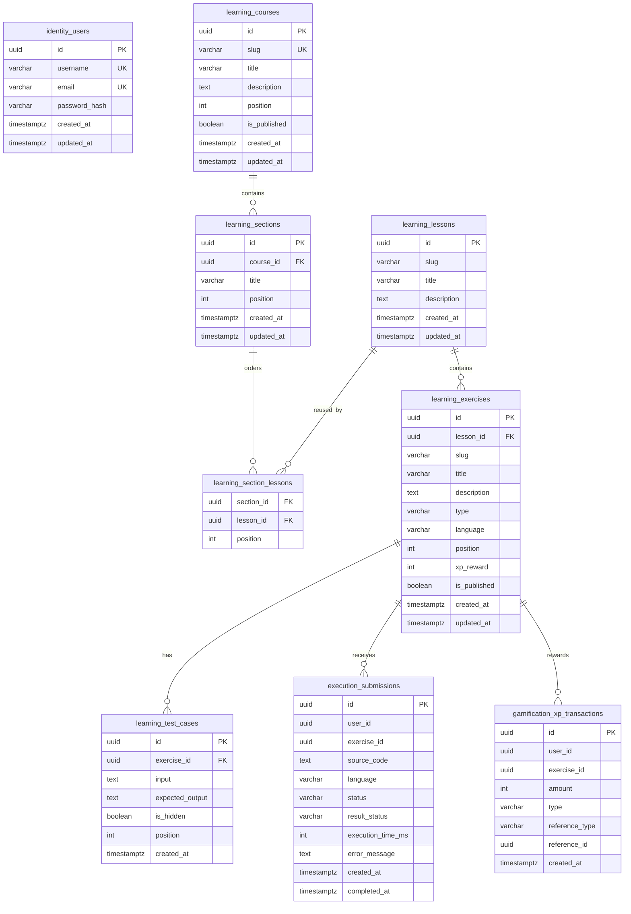

# ERD — Database Schema

## 1. Overview

Database menggunakan PostgreSQL dengan schema per bounded context.

```text id="d4j9qk"
PostgreSQL
│
├── identity
├── learning
├── execution
└── gamification
```

Setiap schema memiliki ownership terhadap tabelnya sendiri.

```text id="j8n5xq"
identity
    └── User & Authentication

learning
    └── Learning Path/Course → Section → Lesson → Exercise → Test Case
    └── User Learning Progress

execution
    └── Submission → Execution Result

gamification
    └── XP Transaction
```

---

# 2. Design Principles

Database design mengikuti beberapa prinsip:

1. Setiap bounded context memiliki schema sendiri.
2. Primary key menggunakan UUID.
3. Foreign key digunakan di dalam bounded context.
4. Cross-schema relationship digunakan secara terbatas.
5. Business rules utama tetap berada di application/domain layer.
6. Submission menyimpan snapshot informasi yang diperlukan untuk audit/history.
7. XP diberikan melalui transaction yang idempotent.
8. Progress tidak menentukan apakah user boleh membuka lesson secara hard-lock.
9. Exercise menentukan language yang digunakan untuk execution.
10. Progress diturunkan dari submission; progress table tidak digunakan pada MVP.

---

# 3. Complete ERD



`user_id` pada schema lain mereferensikan `identity.users.id` secara logical ownership relationship.

Cross-schema physical foreign key dapat digunakan jika deployment/database policy mengizinkannya, tetapi module tetap tidak boleh mengakses tabel module lain secara arbitrary.

---

# 4. Identity Schema

```text id="u6p8tb"
identity.users
```

## Columns

| Column        | Type        | Constraint       |
| ------------- | ----------- | ---------------- |
| id            | UUID        | PK               |
| username      | VARCHAR     | UNIQUE, NOT NULL |
| email         | VARCHAR     | UNIQUE, NOT NULL |
| password_hash | VARCHAR     | NOT NULL         |
| created_at    | TIMESTAMPTZ | NOT NULL         |
| updated_at    | TIMESTAMPTZ | NOT NULL         |

---

# 5. User Identity

User memiliki satu identity record.

```text id="6r8q8j"
identity.users
       │
       │ user_id
       ├───────────────────────────┐
       │                           │
       ▼                           ▼
learning progress             submissions
       │                           │
       ▼                           ▼
exercise progress             XP transactions
```

User ID digunakan sebagai reference oleh bounded contexts lain.

---

# 6. Learning Schema

Learning merupakan bounded context utama untuk content dan progression.

```text id="j2k8p5"
learning
│
├── courses
├── sections
├── section_lessons
├── lessons
├── exercises
└── test_cases
```

---

# 7. Courses

```text id="y8q6bn"
learning.courses
```

Columns:

| Column       | Type        | Constraint       |
| ------------ | ----------- | ---------------- |
| id           | UUID        | PK               |
| slug         | VARCHAR     | UNIQUE, NOT NULL |
| title        | VARCHAR     | NOT NULL         |
| description  | TEXT        | NULL             |
| position     | INT         | NOT NULL         |
| is_published | BOOLEAN     | NOT NULL         |
| created_at   | TIMESTAMPTZ | NOT NULL         |
| updated_at   | TIMESTAMPTZ | NOT NULL         |

Course tidak menyimpan bahasa execution. Source of truth runtime berada pada
Exercise.

---

# 8. Course → Section → Lesson

Relationship:

```text id="9h2b7v"
Course / Learning Path
  │
  └── Section
       ├── Lesson 1
       ├── Lesson 2
       └── Lesson 3
```

Cardinality:

```text id="8mx5ct"
Course 1 ───── N Section
Section N ───── N Lesson
```

Foreign key:

```text id="8qj5gj"
learning.sections.course_id
    → learning.courses.id

learning.section_lessons.section_id
    → learning.sections.id

learning.section_lessons.lesson_id
    → learning.lessons.id
```

---

# 9. Lessons

```text id="v8c7t0"
learning.lessons
```

Columns:

| Column      | Type        | Constraint |
| ----------- | ----------- | ---------- |
| id          | UUID        | PK         |
| slug        | VARCHAR     | NOT NULL   |
| title       | VARCHAR     | NOT NULL   |
| description | TEXT        | NULL       |
| created_at  | TIMESTAMPTZ | NOT NULL   |
| updated_at  | TIMESTAMPTZ | NOT NULL   |

Recommended constraint:

```text id="n9pk5f"
UNIQUE(slug)
```

---

# 10. Lesson → Exercise

Relationship:

```text id="r7kq0g"
Lesson
  │
  ├── Exercise 1
  ├── Exercise 2
  ├── Exercise 3
  └── Exercise 4
```

Cardinality:

```text id="f9k6y3"
Lesson 1 ───── N Exercise
```

Foreign key:

```text id="y2p4bk"
learning.exercises.lesson_id
    → learning.lessons.id
```

---

# 11. Exercises

```text id="1p7s0k"
learning.exercises
```

Columns:

| Column       | Type        | Constraint |
| ------------ | ----------- | ---------- |
| id           | UUID        | PK         |
| lesson_id    | UUID        | FK         |
| slug         | VARCHAR     | NOT NULL   |
| title        | VARCHAR     | NOT NULL   |
| description  | TEXT        | NOT NULL   |
| type         | VARCHAR     | NOT NULL   |
| language     | VARCHAR     | NOT NULL   |
| position     | INT         | NOT NULL   |
| xp_reward    | INT         | NOT NULL   |
| is_published | BOOLEAN     | NOT NULL   |
| created_at   | TIMESTAMPTZ | NOT NULL   |
| updated_at   | TIMESTAMPTZ | NOT NULL   |

Recommended constraint:

```text id="3r7wde"
UNIQUE(lesson_id, slug)
UNIQUE(lesson_id, position)
```

---

# 12. Exercise Type

`type` menentukan tipe exercise.

Initial examples:

```text id="h7a5w2"
code
```

Future:

```text id="g4m1y2"
multiple_choice
quiz
code
debugging
```

Namun jangan menambahkan tabel berbeda untuk setiap exercise type sebelum memang diperlukan.

---

# 13. Test Cases

```text id="f1n4v8"
learning.exercise_test_cases
```

Columns:

| Column          | Type        | Constraint |
| --------------- | ----------- | ---------- |
| id              | UUID        | PK         |
| exercise_id     | UUID        | FK         |
| input           | TEXT        | NOT NULL   |
| expected_output | TEXT        | NOT NULL   |
| is_hidden       | BOOLEAN     | NOT NULL   |
| position        | INT         | NOT NULL   |
| created_at      | TIMESTAMPTZ | NOT NULL   |

Relationship:

```text id="m5k3qp"
Exercise
   │
   ├── Test Case 1
   ├── Test Case 2
   ├── Test Case 3
   └── Test Case N
```

---

# 14. Hidden Test Cases

`is_hidden` menentukan apakah test case ditampilkan ke user.

```text id="9m1d7h"
is_hidden = false
→ public test

is_hidden = true
→ hidden test
```

Hidden test case tetap digunakan untuk menentukan pass/fail.

User hanya tidak mendapatkan detail implementation-nya.

---

# 15. Rejected Alternative — Exercise Progress Table

Bagian ini dipertahankan sebagai catatan desain, tetapi tabel
`learning.exercise_progress` **tidak digunakan pada MVP**. Completion diturunkan
dari submission `PASSED` sesuai `DATA-MODEL.md`.

```text id="w5q4vp"
learning.exercise_progress
```

Columns:

| Column          | Type        | Constraint |
| --------------- | ----------- | ---------- |
| id              | UUID        | PK         |
| user_id         | UUID        | NOT NULL   |
| exercise_id     | UUID        | FK         |
| status          | VARCHAR     | NOT NULL   |
| attempt_count   | INT         | NOT NULL   |
| first_passed_at | TIMESTAMPTZ | NULL       |
| created_at      | TIMESTAMPTZ | NOT NULL   |
| updated_at      | TIMESTAMPTZ | NOT NULL   |

Constraint:

```text id="v8xk4z"
UNIQUE(user_id, exercise_id)
```

---

# 16. Rejected Alternative — Exercise Progress Status

Initial values:

```text id="4x1x0c"
NOT_STARTED
IN_PROGRESS
PASSED
```

`FAILED` tidak perlu menjadi persistent progress status.

Failed attempts dapat dilihat melalui submission history.

Reason:

```text id="d5s1ea"
Exercise Progress
     │
     └── current learning state

Submission
     │
     └── execution history
```

---

# 17. Rejected Alternative — Lesson Progress Table

Tabel `learning.lesson_progress` **tidak digunakan pada MVP**. Lesson completion
dihitung dari completion seluruh published exercise.

```text id="q0n5w9"
learning.lesson_progress
```

Columns:

| Column       | Type        | Constraint |
| ------------ | ----------- | ---------- |
| id           | UUID        | PK         |
| user_id      | UUID        | NOT NULL   |
| lesson_id    | UUID        | FK         |
| status       | VARCHAR     | NOT NULL   |
| started_at   | TIMESTAMPTZ | NULL       |
| completed_at | TIMESTAMPTZ | NULL       |
| created_at   | TIMESTAMPTZ | NOT NULL   |
| updated_at   | TIMESTAMPTZ | NOT NULL   |

Constraint:

```text id="nd1c6q"
UNIQUE(user_id, lesson_id)
```

---

# 18. Lesson Completion

Lesson dianggap completed apabila seluruh required exercises telah passed.

```text id="51r4s7"
Lesson
  │
  ├── Exercise 1 → PASSED
  ├── Exercise 2 → PASSED
  ├── Exercise 3 → PASSED
  └── Exercise 4 → PASSED
                │
                ▼
          Lesson COMPLETED
```

Database tidak perlu menyimpan `required_exercise_count`.

Nilai tersebut dapat dihitung berdasarkan published exercises.

---

# 19. Score

Score bukan entity terpisah pada MVP.

Score dapat dihitung berdasarkan exercise completion.

Contoh:

```text id="k8e3m9"
passed exercises
──────────────────── × 100
total required exercises
```

Jika semua exercise wajib passed untuk completion, maka:

```text id="0o9d7b"
all passed
→ completion = 100%
```

Tidak perlu menyimpan score yang dapat dihitung ulang kecuali nanti ada kebutuhan performance/read-model.

---

# 20. Progression

Platform menggunakan:

```text id="l2r8s0"
Soft Locking
+
Recommended Progression
```

Bukan hard locking.

Artinya database tidak membutuhkan:

```text id="j5d7z9"
unlock_at
is_locked
prerequisite_lesson_id
```

untuk setiap lesson pada MVP.

UI dapat merekomendasikan progression berdasarkan `position` dan progress user.

---

# 21. Execution Schema

```text id="p9v1k3"
execution
└── submissions
```

Submission merupakan attempt user terhadap exercise.

---

# 22. Submissions

```text id="8w5q7e"
execution.submissions
```

Columns:

| Column            | Type        | Constraint |
| ----------------- | ----------- | ---------- |
| id                | UUID        | PK         |
| user_id           | UUID        | NOT NULL   |
| exercise_id       | UUID        | NOT NULL   |
| source_code       | TEXT        | NOT NULL   |
| language          | VARCHAR     | NOT NULL   |
| status            | VARCHAR     | NOT NULL   |
| result_status     | VARCHAR     | NULL       |
| execution_time_ms | INT         | NULL       |
| error_message     | TEXT        | NULL       |
| created_at        | TIMESTAMPTZ | NOT NULL   |
| completed_at      | TIMESTAMPTZ | NULL       |

---

# 23. Submission Status

`status` menggambarkan lifecycle execution.

Initial:

```text id="b0j0x2"
RUNNING
COMPLETED
```

Jika asynchronous execution diperkenalkan:

```text id="q8z0y2"
QUEUED
RUNNING
COMPLETED
```

---

# 24. Submission Result

`result_status` menggambarkan hasil execution.

```text id="q7c2a9"
PASSED
FAILED
TIMEOUT
COMPILE_ERROR
RUNTIME_ERROR
```

Sehingga:

```text id="5b2w9n"
status = COMPLETED
result_status = PASSED
```

atau:

```text id="x3j8r1"
status = COMPLETED
result_status = TIMEOUT
```

---

# 25. Why Store Language on Submission

Walaupun language berasal dari exercise, submission tetap menyimpan:

```text id="1v7y3c"
language
```

sebagai snapshot.

Alasannya:

Jika course configuration berubah di masa depan, submission lama harus tetap menunjukkan runtime yang digunakan ketika submission dibuat.

Contoh:

```text id="q9m2w6"
Exercise language
      ↓
JavaScript

Submission #1
      ↓
language = javascript
```

Jika course kemudian berubah, historical submission tidak ikut berubah.

---

# 26. Why Store Source Code

Submission menyimpan source code yang dikirim user.

Tujuannya:

* submission history
* debugging
* audit
* future code review
* reproducibility

Source code tidak disimpan di runner container setelah execution selesai.

---

# 27. Execution Result Details

MVP tidak perlu membuat tabel:

```text id="v7j1z4"
execution_results
```

terpisah dari submission.

Result sederhana dapat disimpan pada submission.

Jika kebutuhan execution menjadi lebih kompleks, struktur dapat berkembang.

---

# 28. Test Result Storage

MVP tidak wajib menyimpan setiap test case result secara permanen.

Contoh:

```text id="3c8y2r"
Test 1 ✓
Test 2 ✓
Test 3 ✓
Test 4 ✓
```

dapat dikembalikan sebagai API response.

Submission cukup menyimpan final result:

```text id="4a0r9f"
PASSED
```

Jika nantinya membutuhkan detailed execution history, dapat ditambahkan:

```text id="r2x9d4"
execution.test_results
```

tanpa mengubah submission concept.

---

# 29. Gamification Schema

```text id="q8c5m3"
gamification
└── xp_transactions
```

XP menggunakan transaction ledger.

---

# 30. XP Transactions

```text id="a4h9n7"
gamification.xp_transactions
```

Columns:

| Column         | Type        | Constraint |
| -------------- | ----------- | ---------- |
| id             | UUID        | PK         |
| user_id        | UUID        | NOT NULL   |
| exercise_id    | UUID        | NULL       |
| amount         | INT         | NOT NULL   |
| type           | VARCHAR     | NOT NULL   |
| reference_type | VARCHAR     | NOT NULL   |
| reference_id   | UUID        | NOT NULL   |
| created_at     | TIMESTAMPTZ | NOT NULL   |

---

# 31. XP Award

Exercise yang berhasil pertama kali memberikan XP.

```text id="q0h7x2"
Submission PASSED
       │
       ▼
Exercise first pass?
       │
       ├── NO → no XP
       │
       └── YES
             │
             ▼
         Award XP
```

XP tidak diberikan untuk setiap submission yang passed.

---

# 32. XP Idempotency

XP transaction harus memiliki unique reference.

Contoh:

```text id="c1r7f5"
reference_type = "exercise_completion"
reference_id   = exercise_id + user_id
```

Secara implementasi dapat menggunakan unique constraint yang menjamin satu award untuk satu user/exercise.

Conceptually:

```text id="2h7m9q"
UNIQUE(user_id, exercise_id, type)
```

untuk transaction type yang memang one-time.

Tujuannya mencegah:

```text id="5p2n7d"
Submission 1 → PASSED → +50 XP
Submission 2 → PASSED → +50 XP
Submission 3 → PASSED → +50 XP
```

menjadi:

```text id="c3n6z8"
Submission 1 → PASSED → +50 XP
Submission 2 → PASSED → no XP
Submission 3 → PASSED → no XP
```

---

# 33. XP Balance

Tidak perlu membuat:

```text id="z1p5v4"
users.xp
```

sebagai source of truth.

Balance dapat dihitung:

```text id="p6q9r2"
SUM(gamification.xp_transactions.amount)
```

Jika nanti performance membutuhkan cached balance, dapat ditambahkan sebagai optimization.

Source of truth tetap transaction ledger.

---

# 34. Cross-Schema Logical Relationships

Logical relationship:

```text id="3g4y8n"
identity.users
     │
     ├────────── execution.submissions
     │
     └────────── gamification.xp_transactions
```

Learning:

```text id="9f3m6x"
learning.courses
      │
      ▼
learning.lessons
      │
      ▼
learning.exercises
      │
      ▼
learning.test_cases
```

Execution:

```text id="x8v2k1"
learning.exercises
      │
      ▼
execution.submissions
```

Gamification:

```text id="y4j7m2"
learning.exercises
      │
      ▼
gamification.xp_transactions
```

---

# 35. Foreign Key Policy

Within the same bounded context:

```text id="5j7k1c"
USE FOREIGN KEYS
```

Example:

```text id="7g2m8p"
sections.course_id
→ courses.id
```

Across bounded contexts:

```text id="r1q5x6"
LOGICAL REFERENCES
```

Example:

```text id="h8c3m0"
execution.submissions.user_id
→ identity.users.id
```

Whether PostgreSQL physical cross-schema FK constraints are used is an infrastructure decision.

Domain/module ownership remains separate either way.

---

# 36. Indexing

Minimum indexes:

### Learning

```text id="w2p7m4"
sections(course_id, position)
section_lessons(section_id, position)
exercises(lesson_id, position)
test_cases(exercise_id, position)
```

### Execution

```text id="q5m8v1"
submissions(user_id, created_at)
submissions(exercise_id, created_at)
submissions(user_id, exercise_id, created_at)
```

### Gamification

```text id="n6x2c9"
xp_transactions(user_id, created_at)
xp_transactions(user_id, exercise_id, type)
```

---

# 37. Uniqueness Constraints

Recommended:

```text id="r4q8m1"
identity.users
├── UNIQUE(username)
└── UNIQUE(email)

learning.courses
└── UNIQUE(slug)

learning.sections
└── UNIQUE(course_id, position)

learning.section_lessons
├── UNIQUE(section_id, lesson_id)
└── UNIQUE(section_id, position)

learning.lessons
└── UNIQUE(slug)

learning.exercises
├── UNIQUE(lesson_id, slug)
└── UNIQUE(lesson_id, position)

learning.test_cases
└── UNIQUE(exercise_id, position)

gamification.xp_transactions
└── unique constraint for one-time exercise XP
```

---

# 38. Delete Policy

Content deletion harus hati-hati karena execution history bergantung pada exercise.

Untuk MVP:

```text id="q9k1f7"
Course
Lesson
Exercise
```

sebaiknya menggunakan:

```text id="x4r7v2"
soft delete / publish state
```

daripada hard delete.

Existing submission history harus tetap dapat direferensikan.

---

# 39. Published State

Content menggunakan:

```text id="a8p4k6"
is_published
```

untuk menentukan apakah content tersedia bagi user.

Unpublished content tetap berada di database.

Ini memungkinkan:

```text id="j5v8n2"
draft
publish
unpublish
```

tanpa menghancurkan historical data.

---

# 40. Timestamps

Entity utama menggunakan:

```text id="m7c1x9"
created_at
updated_at
```

Submission menggunakan:

```text id="f2p8q4"
created_at
completed_at
```

Progress menggunakan:

```text id="y9r3m6"
started_at
completed_at
created_at
updated_at
```

Semua timestamp menggunakan:

```text id="q5k7v1"
TIMESTAMPTZ
```

dan disimpan dalam UTC.

---

# 41. UUID Strategy

Semua primary key menggunakan UUID.

Contoh:

```text id="b4n8x2"
users.id
courses.id
lessons.id
exercises.id
submissions.id
xp_transactions.id
```

UUID dibuat oleh application atau database dengan satu strategy yang konsisten.

---

# 42. Derived Data

Jangan menyimpan data yang dapat dihitung dengan mudah.

Contoh yang tidak perlu:

```text id="v3p6k8"
course.lesson_count
lesson.exercise_count
exercise.pass_rate
user.total_xp
lesson.score
```

Data tersebut dapat dihitung dari source of truth.

Caching/materialized read model dapat ditambahkan jika performance membutuhkan.

---

# 43. Completion Invariant

Core invariant:

```text id="k4m8z1"
Lesson COMPLETED
IF AND ONLY IF
all required exercises are PASSED
```

Database menyimpan submission history. Application layer menghitung exercise
completion dari submission `PASSED` dan mengevaluasi apakah seluruh exercise
sudah passed.

---

# 44. XP Invariant

Core invariant:

```text id="n8c2r5"
XP awarded for exercise completion
MUST NOT occur more than once
for the same user and exercise.
```

Database unique constraint menjadi final safety net.

Application transaction:

```text id="m7x4p2"
PASS submission
      │
      ▼
Check first passed submission
      │
      ▼
Check first_passed_at
      │
      ▼
Create XP transaction
```

Kedua perubahan harus berada dalam transaction database.

---

# 45. Submission → Progress

Flow:

```text id="r6q2m8"
Submission
    │
    ▼
Execution Result
    │
    ├── FAILED
    │
    └── PASSED
          │
          ▼
exercise completion derived
          │
          ▼
first_passed_at
          │
          ▼
Award XP
```

Execution result dan learning progress tidak harus berada dalam schema yang sama.

Application layer mengorkestrasi transaction/boundary yang diperlukan.

---

# 46. Recommended Transaction

Ketika submission berhasil:

```text id="g8p2v5"
BEGIN TRANSACTION

1. Update submission
2. Determine first pass from submission history
3. Create XP transaction if first pass
4. Derive lesson completion when needed

COMMIT
```

Jika salah satu critical operation gagal:

```text id="h4m9x7"
ROLLBACK
```

Dengan demikian tidak terjadi kondisi:

```text id="p3k8v1"
Exercise PASSED
tetapi XP tidak pernah diberikan
```

tanpa mekanisme recovery.

---

# 47. Final Schema

```text id="v7m2c4"
PostgreSQL
│
├── identity
│   └── users
│
├── learning
│   ├── courses
│   ├── sections
│   ├── section_lessons
│   ├── lessons
│   ├── exercises
│   └── test_cases
│
├── execution
│   └── submissions
│
└── gamification
    └── xp_transactions
```

---

# 48. Final Relationship Model

```text id="x1q7m5"
                    identity.users
                          │
               ┌──────────┴──────────┐
               ▼                     ▼
      execution.submissions   gamification.xp_transactions
               │                     │
               └───────────┬───────────┘
                           ▼
                  learning.exercises
```

Content hierarchy:

```text id="j5k9p2"
Course
  │
  └── Lesson
        │
        └── Exercise
              │
              └── Test Case
```

---

# 49. Final Decision Summary

| Area                    | Decision                             |
| ----------------------- | ------------------------------------ |
| Database                | PostgreSQL                           |
| Database topology       | Schema per bounded context           |
| Identity                | `identity.users`                     |
| Content                 | Course → Section → Lesson → Exercise |
| Test cases              | Owned by Exercise                    |
| User progress           | Derived from submission history      |
| Submission              | Separate `execution` schema          |
| XP                      | Transaction ledger                   |
| Score                   | Derived                              |
| Total XP                | Derived                              |
| Hard locking            | No                                   |
| Recommended progression | Yes                                  |
| Exercise completion     | All required exercises passed        |
| XP reward               | First successful exercise completion |
| Submission language     | Snapshot from exercise               |
| Test result persistence | Final result only for MVP            |
| IDs                     | UUID                                 |
| Time                    | TIMESTAMPTZ / UTC                    |
| Content deletion        | Prefer publish/unpublish             |
| Cross-module access     | Through application contracts        |
| Cross-schema FK         | Policy to finalize in infrastructure |

---

# 50. ERD Status

ERD ini dianggap **draft final untuk cross-check**, bukan langsung migration.

Sebelum membuat migration SQL, lakukan consistency check terhadap:

```text
PRD
   ↕
Data Model
   ↕
ERD
   ↕
API Contract
   ↕
Execution Architecture
```

Jika semuanya konsisten, ERD dapat dikunci dan diterjemahkan menjadi migration files.
